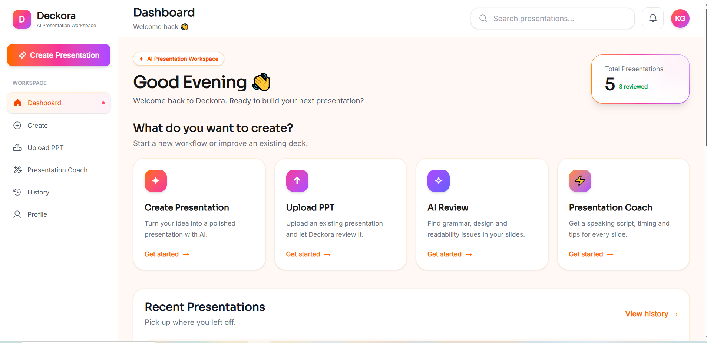
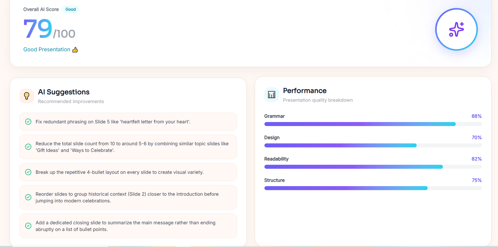
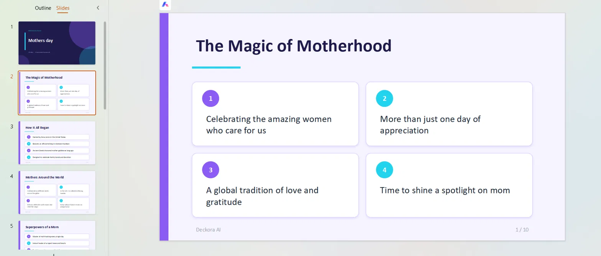

# Deckora AI

AI presentation workspace: generate a deck from a topic, review it with Gemini, get a speaking script from the Presentation Coach, upload an existing PPTX/DOCX/PDF for analysis, and download the result as a real `.pptx` file.

**Stack:** React + Vite + Tailwind (frontend) · Express (backend) · Firebase Auth + Firestore · Google Gemini API
## Screenshots




## Features

- Email/password login, Google login, forgot password
- Create presentations with Gemini (topic, slide count, audience, tone, language)
- Presentations saved per user in Firestore, listed on the Dashboard and History pages
- AI Review: real Gemini scores for Grammar, Design, Readability and Structure, an overall score (the average of the four) and 5 suggestions. The review is saved on the presentation, so Gemini is only called once per version
- Upload a `.pptx`, `.docx` or `.pdf` and get an AI analysis
- Presentation Coach: speaking script, timing and tips per slide
- Download any presentation as a styled `.pptx` that uses the theme chosen on the Create page (Modern, Minimal or Business): title and closing slides, card-style layouts that vary from slide to slide, and slide numbers

## Project structure

```
Deckora/
├── backend/            Express API (server.js) - the only place the Gemini key is used
│   ├── server.js
│   └── .env.example
├── client/             React app (Vite)
│   ├── src/
│   └── .env.example
├── firestore.rules     Firestore security rules (users only see their own presentations)
└── firebase.json       Lets the Firebase CLI deploy firestore.rules
```

## Requirements

- Node.js 20.19+ or 22.12+ (required by Vite) and npm
- A Firebase project (free Spark plan is enough)
- A Gemini API key from https://aistudio.google.com/apikey

## Setup

### 1. Firebase (client configuration)

1. In the [Firebase console](https://console.firebase.google.com/) create a project (or open your existing one).
2. **Authentication > Sign-in method**: enable **Email/Password** and **Google**.
3. **Firestore Database**: create a database.
4. **Firestore Database > Rules**: paste the contents of [`firestore.rules`](firestore.rules) and click **Publish**.
   (Or with the Firebase CLI: `firebase deploy --only firestore:rules --project YOUR_PROJECT_ID`.)
5. **Project settings > Your apps**: add a Web app and copy its config values.
6. Create `client/.env` from the example and fill in the values:

   ```bash
   cd client
   cp .env.example .env   # Windows: copy .env.example .env
   ```

   | Variable | Where it comes from |
   | --- | --- |
   | `VITE_FIREBASE_API_KEY` | Firebase web app config `apiKey` |
   | `VITE_FIREBASE_AUTH_DOMAIN` | `authDomain` |
   | `VITE_FIREBASE_PROJECT_ID` | `projectId` |
   | `VITE_FIREBASE_STORAGE_BUCKET` | `storageBucket` |
   | `VITE_FIREBASE_MESSAGING_SENDER_ID` | `messagingSenderId` |
   | `VITE_FIREBASE_APP_ID` | `appId` |
   | `VITE_API_URL` | URL of the backend, `http://localhost:5000` locally |

   Firebase web config values are not secrets (they identify your project); your Firestore rules are what protect the data.

### 2. Gemini (backend configuration)

```bash
cd backend
cp .env.example .env   # Windows: copy .env.example .env
```

Open `backend/.env` and set `GEMINI_API_KEY`. This key stays on the server: the browser never sees it. Optional settings (`PORT`, `GEMINI_MODEL`, `GEMINI_THINKING_LEVEL`, `CLIENT_ORIGIN`, `RATE_LIMIT_PER_MIN`) are documented in `backend/.env.example`.

### 3. Install and run

Use two terminals.

**Backend** (http://localhost:5000):

```bash
cd backend
npm install
npm run dev      # or: npm start
```

**Frontend** (http://localhost:5173):

```bash
cd client
npm install
npm run dev
```

Open http://localhost:5173. To check the backend, visit http://localhost:5000/api/health.

## API

| Method | Route | Purpose |
| --- | --- | --- |
| GET | `/api/health` | Health check |
| POST | `/api/generate` | `{ topic, slides, audience, tone, language }` → `{ result }` (slide text) |
| POST | `/api/review` | `{ content }` → `{ score, grammar, design, readability, structure, suggestions[] }` |
| POST | `/api/coach` | `{ content }` → `{ result }` (script, timing, tip per slide) |
| POST | `/api/upload` | multipart `file` (.pptx/.docx/.pdf, max 20MB) → `{ result, review }` |
| POST | `/api/download` | `{ title, content, theme }` (`Modern`, `Minimal` or `Business`) → `.pptx` file |

## Firestore data model

Collection `presentations`, one document per presentation:

`userId`, `title`, `theme`, `slides`, `language`, `audience`, `tone`, `content` (slide text), `createdAt`, and `review` (saved AI review, removed automatically when the content is edited).

`firestore.rules` only lets the signed-in owner (`userId == request.auth.uid`) read, update or delete a presentation, and only lets users create presentations for themselves.

## Notes

- **Design score:** Gemini only receives the text of the slides, so the Design score reflects content layout (bullet count, density, balance), not colors or images.
- **Uploads:** text is extracted from `.pptx`, `.docx` and `.pdf`. Old `.ppt` files and scanned/image-only PDFs are not supported.
- **Backend access:** the API endpoints are not tied to a Firebase login and are protected by a per-IP rate limit. If you deploy publicly, add Firebase ID token verification (`firebase-admin`) before exposing it.
- **Model:** the default model is `gemini-3.6-flash` with thinking set to `minimal` for speed. If you switch to `gemini-3.8-flash`, set `GEMINI_THINKING_LEVEL=low`.

## Troubleshooting

| Problem | Fix |
| --- | --- |
| Blank page and "Missing Firebase configuration" in the console | Create `client/.env` (step 1.6) and restart `npm run dev` |
| "Cannot reach the Deckora server" | Start the backend and check `VITE_API_URL` |
| CORS error in the browser | Add your frontend URL to `CLIENT_ORIGIN` in `backend/.env` |
| `permission-denied` from Firestore | Publish `firestore.rules`; old documents without a `userId` field are not readable |
| "Gemini quota or rate limit reached" | Wait a minute or check your Gemini API quota |

## Deployment

- **Backend (Render, Railway, etc.):** root directory `backend`, build command `npm install`, start command `npm start`. Set the environment variable `GEMINI_API_KEY`, and set `CLIENT_ORIGIN` to your frontend URL (no trailing slash).
- **Frontend (Vercel, Netlify, etc.):** root directory `client`, build command `npm run build`, output directory `dist`. Set all `VITE_*` variables from `client/.env.example`, with `VITE_API_URL` pointing to your deployed backend. `client/vercel.json` makes page refreshes work with React Router.
- **Firebase:** Authentication > Settings > Authorized domains: add your frontend domain so Google login works.
